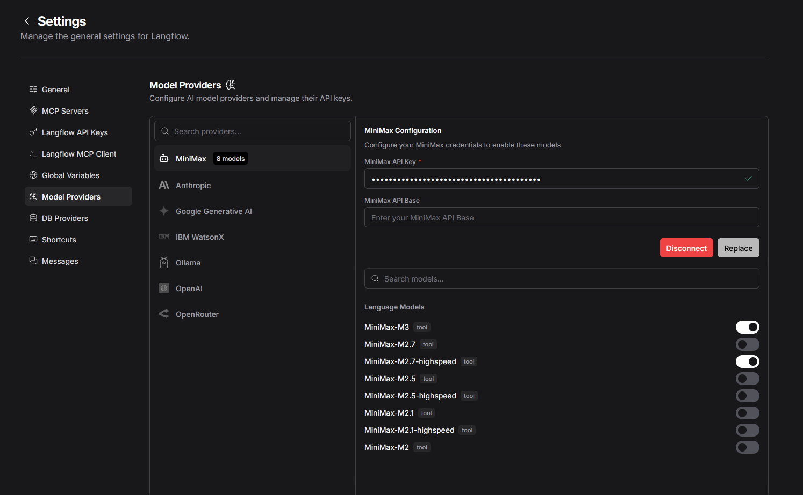
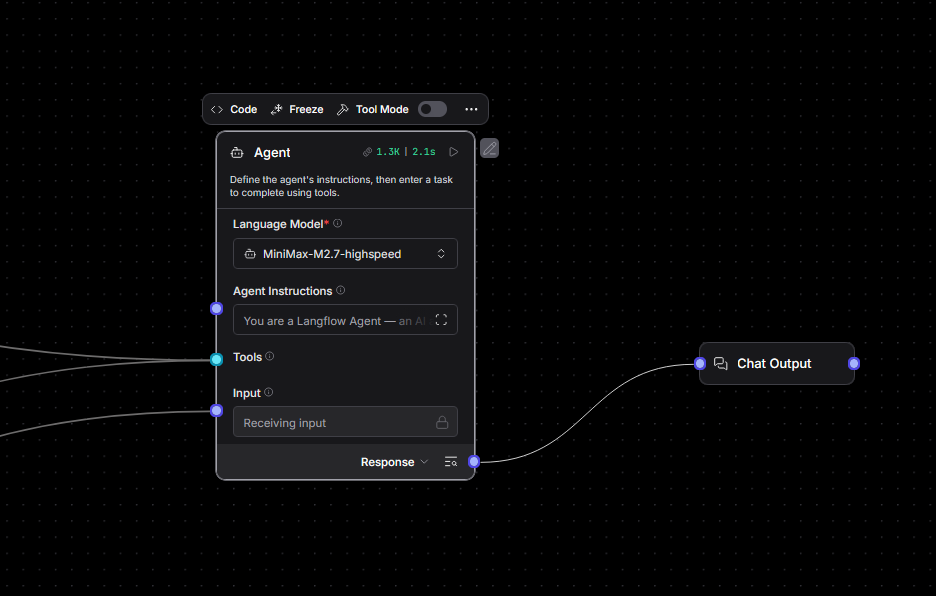

# st-langflow-aio

<p align="center">
  
</p>

<p align="center">
  
</p>

**Langflow + MiniMax als voll integrierter Global Model Provider.**

> v0.2.0 — verifiziert funktionsfaehig, Open Source, kein API-Key noetig fuer das Image selbst.

## Was es macht

- MiniMax erscheint in **Settings → Model Providers** und im **Agent "Model Provider" Dropdown** — wie OpenAI, Anthropic, Ollama
- 8 MiniMax-Modelle (M3, M2.7, M2.7-highspeed, M2.5, M2.5-highspeed, M2.1, M2.1-highspeed, M2) auswaehlbar
- Tool Calling, Vision, Video, Thinking (M3) alle unterstuetzt
- Langflow + ffmpeg + Chromium (puppeteer) + Node.js 20 + yt-dlp vorinstalliert

## Quickstart

```bash
git clone https://github.com/steimbyte/st-langflow-aio.git
cd st-langflow-aio

# .env anlegen
cat > .env << 'EOF'
LANGFLOW_SECRET_KEY=$(python3 -c "from cryptography.fernet import Fernet; print(Fernet.generate_key().decode())")
LANGFLOW_SUPERUSER=admin@example.com
LANGFLOW_SUPERUSER_PASSWORD=changeme
MINIMAX_API_KEY=sk-cp-your-key-here
EOF

# Bauen und starten
docker build --no-cache -t st-langflow-aio .
docker compose up -d
```

Browser → http://localhost:7860

- **Settings → Model Providers → MiniMax** → API-Key eintragen → Save
- Neuer Flow → **Agent** → Model Provider: **MiniMax** → Model: **MiniMax-M3**

## Setup ohne MiniMax

Das Image laeuft auch ohne MiniMax-Key. Setze einfach `MINIMAX_API_KEY=` (leer) oder lass die Zeile weg — die anderen Tools (Langflow, ffmpeg, Chromium, yt-dlp) funktionieren unabhaengig.

## Verifizieren

```bash
# Patch-Status (alle 5 Files muessen OK sein)
docker exec -it $(docker ps -qf name=langflow) python3 /tmp/verify_inplace.py

# Echter API-Test mit deinem Key
docker exec -it $(docker ps -qf name=langflow) python3 /tmp/smoke_test.py sk-cp-your-key
```

## Unterstuetzte Modelle

| Model | Context | Features |
|-------|---------|----------|
| MiniMax-M3 | 1M | Bild, Video, Thinking |
| MiniMax-M2.7 | 200k | highspeed ~100 tps |
| MiniMax-M2.5 | 200k | highspeed ~100 tps |
| MiniMax-M2.1 | 200k | highspeed ~100 tps |
| MiniMax-M2 | 200k | Agentic, Reasoning |

API-Key holen: https://platform.minimax.io/

## Troubleshooting

| Problem | Loesung |
|---------|--------|
| MiniMax nicht in Settings sichtbar | `docker compose down -v && docker compose up -d` |
| `invalid x-api-key` Fehler | Key im [MiniMax Console](https://platform.minimax.io/) pruefen, kein Whitespace |
| Provider im Agent nicht waehlbar | Browser Hard-Refresh (Strg+Shift+R) |
| Alte Patches aktiv | `docker compose down -v && docker rmi st-langflow-aio -f && docker build --no-cache .` |

## Architektur

5 Backend-Files in `site-packages/lfx/` werden beim Docker-Build gepatcht:

| Datei | Zweck |
|-------|--------|
| `lfx/base/models/minimax_constants.py` | NEU — Modelliste |
| `lfx/base/models/model_metadata.py` | `MODEL_PROVIDER_METADATA["MiniMax"]` |
| `lfx/base/models/unified_models/provider_queries.py` | `MINIMAX_MODELS_DETAILED` |
| `lfx/base/models/model_input_constants.py` | `MODEL_PROVIDERS_DICT` + `_LIST` |
| `lfx/base/models/unified_models/instantiation.py` | `get_llm()` base_url Special-Case |
| `lfx/components/minimax/minimax.py` | `MiniMaxModelComponent` (LCModelComponent) |

Details: [docs/INTEGRATION.md](docs/INTEGRATION.md)

## Struktur

```
st-langflow-aio/
├── Dockerfile                    # Build mit allen Patches
├── docker-compose.yml            # Postgres + Langflow
├── inject/
│   ├── patch_full_provider.py   # Hauptpatch (5 Files)
│   ├── verify_inplace.py        # Verifiziert die Patches
│   └── smoke_test.py            # API-Smoke-Test
└── docs/INTEGRATION.md          # Tech-Doku
```

## Releases

- [v0.2.0](https://github.com/steimbyte/st-langflow-aio/releases/tag/v0.2.0) — aktuell, verifiziert
- v0.1.x — Pre-release Iterationen

## Lizenz & Credits

MiniMax nutzt das offizielle Anthropic SDK gegen den MiniMax Anthropic-kompatiblen Endpunkt — kein separates MiniMax SDK noetig.

API-Docs: https://platform.minimax.io/docs/api-reference/text-anthropic-api

---

## Hinweis zur KI-Unterstuetzung

Bei der Entwicklung dieses Projekts wurden teilweise oder vollstaendig KI-gestuetzte Tools und Technologien eingesetzt.
